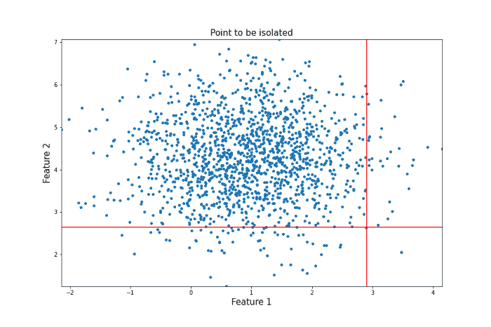
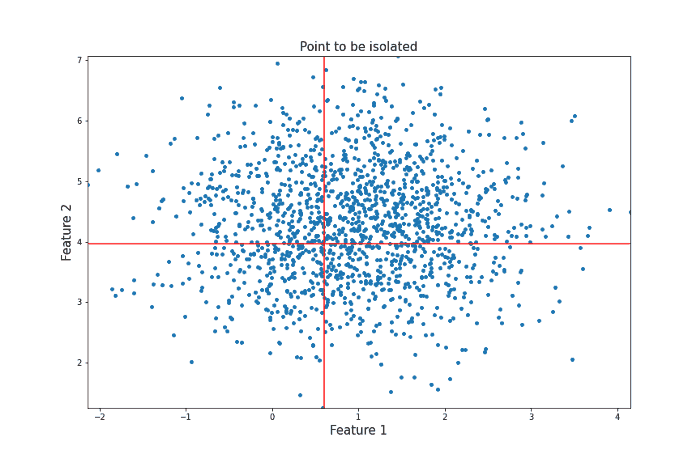

# Isolation Forest Anomaly Detection System

## Algorithm Explanation and Effectiveness

**Algorithm Overview:**

Isolation Forest is an ensemble learning method specifically designed for anomaly detection in high-dimensional datasets. It isolates anomalies rather than profiling normal data points, making it particularly effective for identifying outliers in large and complex datasets. The algorithm works by constructing multiple decision trees (known as isolation trees) to randomly select features and split the data, creating isolated branches for each data point. Anomalies are detected based on the path length: shorter paths indicate anomalies, as they are more easily isolated from the rest of the data.

**Key Steps in Isolation Forest:**
1. **Random Sampling**: Randomly selects a subset of features and data points.
2. **Tree Construction**: Builds multiple isolation trees by recursively splitting the data along randomly chosen features.
3. **Path Length Calculation**: Measures how quickly each data point is isolated from others in the tree.
4. **Anomaly Scoring**: Determines anomaly scores based on the average path length across all trees. Shorter path lengths correspond to higher anomaly scores.

**Algorithm Intuition:**

Isolation Forest leverages the principle that anomalies are often isolated from the majority of data points. By randomly splitting the data space into subspaces, the algorithm seeks to isolate each data point. Anomalies, being outliers, require fewer splits to be isolated compared to typical data points.

To illustrate, consider two scenarios:

1. Anomaly: A data point with few nearby neighbors can be isolated with fewer splits, as there are fewer paths to traverse in the data space. Consider the following gif.

   *Source*: [Unit8 Financial Transaction Anomaly Detector Guide](https://unit8.com/resources/a-guide-to-building-a-financial-transaction-anomaly-detector/)

    <p align="center">
        
    </p>

2. Typical Data Point: A data point surrounded by many similar points requires more splits to be isolated, as there are numerous paths to explore. Consider the following gif.
   
   *Source*: [Unit8 Financial Transaction Anomaly Detector Guide](https://unit8.com/resources/a-guide-to-building-a-financial-transaction-anomaly-detector/)

    <p align="center">
        
    </p>

While this intuition provides a general understanding, the actual Isolation Forest model iteratively constructs decision trees to arrive at a more robust anomaly score, accounting for inherent variability and ensuring accurate outlier identification.

**Effectiveness of Isolation Forest:**
- **High Efficiency**: Performs well with large datasets due to its linear time complexity, making it scalable and efficient.
- **Robust to High Dimensionality**: Handles high-dimensional data effectively, as it does not rely on distance metrics that can become less meaningful in high-dimensional spaces.
- **Simplicity and Speed**: The algorithm is easy to implement and computationally efficient compared to traditional methods such as distance-based outlier detection.
- **Effective Anomaly Detection**: Successfully identifies anomalies even when they are sparsely distributed or when their characteristics differ significantly from normal data points.

In the context of the payment dataset, Isolation Forest has proven effective in detecting unusual transaction patterns and identifying outliers in real-time data. The algorithm's ability to isolate anomalies quickly and accurately makes it a valuable tool for fraud detection and other applications requiring robust anomaly detection.

## Setup and Installation
1. Clone the repository:  
   ```bash
   git clone https://github.com/Mu99-M/Isolation-Forest-Anomaly-Detection-System.git
   ```
2. Navigate to the project directory:  
   ```bash
   cd Isolation-Forest-Anomaly-Detection-System
   ```
3. Install required dependencies using:  
   ```bash
   pip install -r requirements.txt
   ```

## How to Use
1. **Run the Data Stream Simulation**:  
   The script simulates a continuous flow of data with embedded seasonal patterns. Users can configure parameters to customize the seasonality and randomness of the stream.
2. **Anomaly Detection**:  
   The Isolation Forest model detects and flags anomalies in the data stream. The results are displayed in real-time as the stream progresses.
3. **Visualization**:  
   The real-time data and detected anomalies are plotted using Matplotlib, allowing users to see anomalies as they appear.

## Results
The final output is a plot of the data stream with anomalies marked. This can be used to evaluate the system's effectiveness in detecting outliers.

## References
- [An Anomaly Detection Approach Based on Isolation Forest Algorithm for Streaming Data using Sliding Window](https://www.sciencedirect.com/science/article/pii/S1474667016314999)
- [Anomaly Detection Using Isolation Forest in Python](https://www.digitalocean.com/community/tutorials/anomaly-detection-isolation-forest)
- [Unit8 Financial Transaction Anomaly Detector Guide](https://unit8.com/resources/a-guide-to-building-a-financial-transaction-anomaly-detector/)